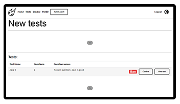
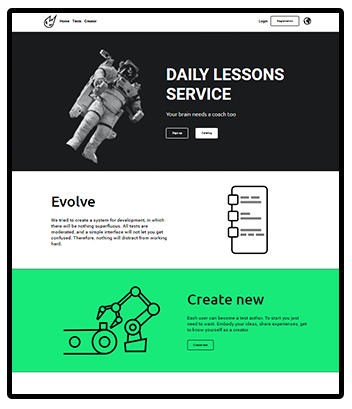
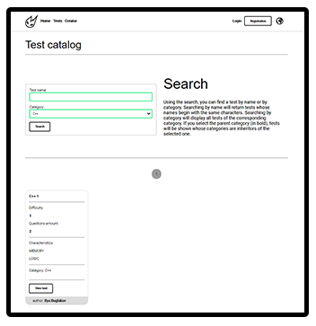
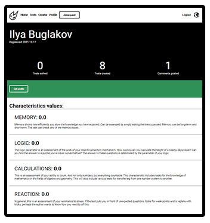
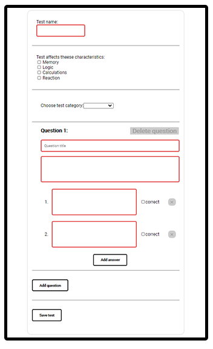
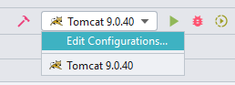
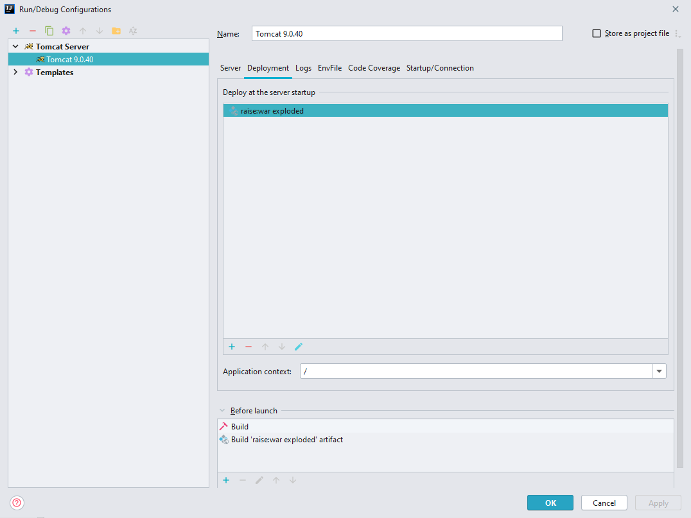
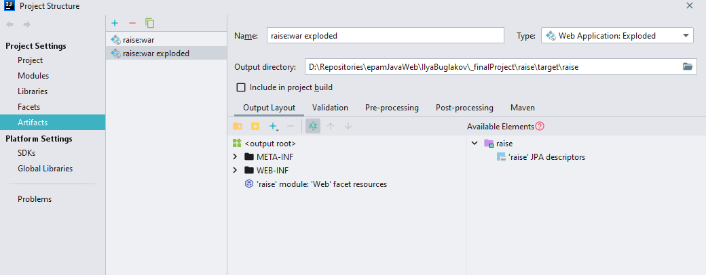
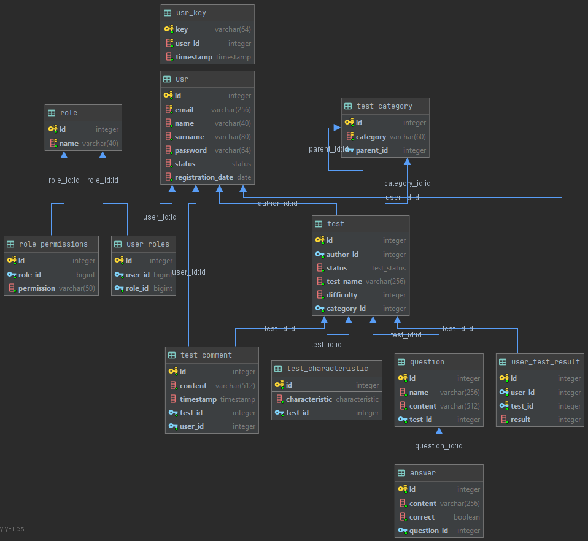

# Raise

Raise is a service aimed to improve everyday user experience in the sphere of studying and
knowledge acquisition.

## Table of contents
1. [Introduction](#Introduction)
2. [General info](#General-info)
    - [Roles](#Roles)
3. [Showcase](#Showcase)
4. [Requirements](#Requirements)
5. [Build](#Build)
6. [Testing](#Testing)
7. [Usage](#Usage)
    - [Prepared accounts](#Prepared-accounts)
    - [Changing the locale](#Changing-locale)
    - [Passing test](#Passing-test)
    - [Creating test](#Creating-test)
    - [Administrating the application](#Administrating-the-application)
7. [Database structure](#Database-structure)
7. [Technologies](#Technologies)
___
## Introduction
Raise is a service where you can either create or pass tests. Community created content
is being moderated, so you won't see any obscene content. Also, there are comment
sections for each test, so you can share your opinion with other users.

Each test is specified by an arbitrary set of four characteristics:
- Memory
- Logic
- Calculations
- Reaction

So, when you pass the test, result will affect the performance of your personal
characteristics set. This is how statistics are kept. Statistics cen be viewed in
user profile.

___

## General info

Time for passing the test is not limited. After the end of testing user will see its result and
questions, where he made a mistake. Even semi-correct answers can bring points.

Subject rights in applications are specified by the set of permissions. For example,
to confirm the test, you must have "confirm:test" permission. Subject permissions set
is known from subjects roles set. Each role has specified suite of permissions.

#### Roles
- Guest
    - Can pass tests, but result won't be saved.
    - Can view comments and user profiles.
    - Can log in or register anytime.
    - Don't have access to test creator.
- User
    - Сan pass test, result will be saved. Each time when user passes the same test,
      new result will be saved only if it's greater than previous.
    - Сan write comments.
    - Сan see other users profiles and edit his own profile.
    - Have access to test creator. After adding the test is sent for moderation. Maximum user can have 3 unapproved
      tests simultaneously.
- Admin
    - Has all permissions in application.
    - Can ban comments.
    - Has access to 'admin panel', where he can
      see all new tests and confirm or ban them.
    - Status of test created by an admin
      is 'CONFIRMED' by default.

___
## Showcase

___
## Requirements

To run this project you will need:
- JDK 14 or higher
- PostgreSQL database
- Maven - for building sources
- Tomcat - for starting server

Other dependencies will be downloaded by maven
___
## Build

First you need to install and start PostgreSQL server. Then you should run sql scripts
from `/sql` folder:
- `1_drop_database.sql` - will drop raise_db if it exists
- `2_create_database.sql` - will create the raise_db and its user
- `3_create_tables.sql` - will fill raise_db with tables and enums
- `4_init_tables.sql` - will fill raise_db tables with some content, such as superuser,
  test categories and directly by tests.

### Building war

For build, you should start maven in project root directory and build `war` file
using maven war plugin. This plugin dependency is specified in `pom.xml`: `<packaging>war</packaging>`.

`mvn compile war:war
`

Now `raise.war` will appear in project target directory. You should move that
archive to the Tomcat `/webapps` folder.

After that, you need to start application server using Tomcat and access it through
web browser.

### Building at the Intellij IDEA

After clone from github, create `Tomcat 9.0.40` configuration. 
Click `fix` button and choose `raise_war_exploded`. 

Note that application path should be `/`. To do so in IntelliJ IDEA go to `Edit configuration`
And at then, in deployment, change application context.

If application can't run, check if all dependencies are downloaded and libraries are added to `lib` folder. 
You can check that at `Project structure -> Artifacts -> raise:war exploded -> Available Elements (on the right)`

___
## Testing

Some tests require test database. So, if you need to run project tests, create
`raise_test_db` by scripts from `/sql/test_db` folder.

After creating and filling this database, nothing can stop you from running tests.

___
## Usage
After running webapp in Tomcat container, you can start using application.
To start, you can register or try to pass tests without authorization. If you choose
to register, then click on `Sign up` button at the top-right corner and fill up the
registration form. After sending a form, you must confirm your email. Todo so, follow
the link from your email inbox. Maybe check spam folder. After that, simply login in
to your new account.

If you don't want to register, you can log in to any of prepared accounts.

### Prepared accounts
To log in
as **admin** try email: `admin@gmail.com` with password: `121212`.

To log in as simple user,
try email:`user@gmail.com` and password:`121212`.

### Changing locale
Raise application is localized to **English US**, **Russian** and **Swedish**. You can
change locale anytime by clicking on the globe button at right side of navbar. Then choose
preferred language in the modal window.

### Passing test
To past the test you first need to choose it. You can view all the tests in the catalog.
Link to catalog is signed as `Tests` at the navbar. When choose a test,
first you will see test preview there are described some test parameters and comment
section also will be here. To start testing, click `Start testing` button.

After finishing the test, you will see test result page. If you are authenticated, your
results also will be saved.

### Creating test
To create test, follow to the constructor by clicking `Constructor` link at the navbar.
There you can dynamically form test. When test is complete, submit it and wait until
an admin confirm it.

### Administrating the application
If you have admin permissions, then `Admin panel` button will appear at your nav. At the
admin panel page you can confirm or ban new tests. Admin panel provides some information
about each test, such as questions amount and questions names.
You also can view each test to check all the information.

___
## Database structure

___
## Technologies

There is list of technologies used in project:
- [JDK 14](https://www.oracle.com/java/technologies/javase/jdk14-archive-downloads.html)
- [Maven](https://maven.apache.org/) - Project build tool
- [Java EE](https://www.oracle.com/java/technologies/java-ee-glance.html) - Java Servlet, JSP(Java server pages)
- [Tomcat](http://tomcat.apache.org/) - Servlet container
- [PostgreSQL](https://www.postgresql.org/) - OpenSource SQL database
- [JDBC](https://docs.oracle.com/javase/8/docs/technotes/guides/jdbc/) - Java Database Connectivity API
- [JSTL](https://docs.oracle.com/javaee/5/tutorial/doc/bnake.html) - Library for JSP
- [TestNG](https://testng.org/doc/) - Test framework
- [Mockito](https://site.mockito.org/) - Mocks framework, useful for testing
- [Apache Shiro](https://shiro.apache.org/) - Simple permission-based authentication framework
- [JavaMail](https://www.oracle.com/java/technologies/javamail.html) - Java mail API
- [GSON](https://www.oracle.com/java/technologies/javamail.html) - Google JSON parser
- [Lombock](https://projectlombok.org/) - Library for data class simplification and more
- [Log4j2](https://logging.apache.org/log4j/2.x/) - Logging library
